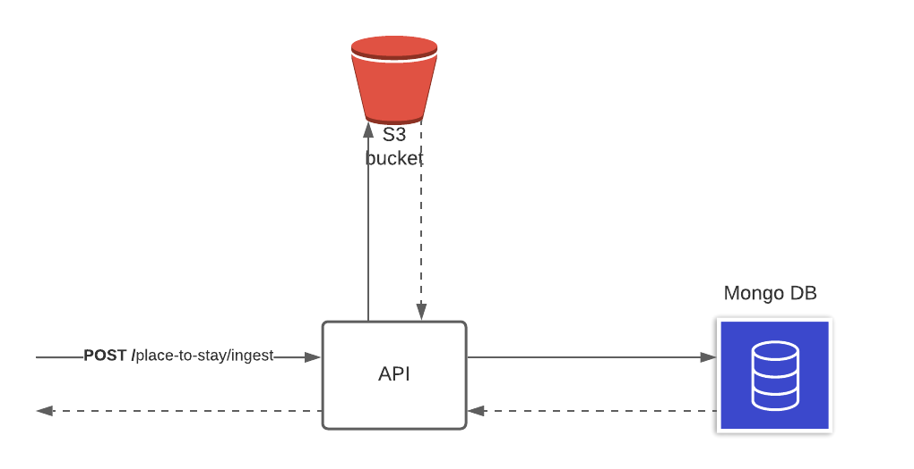

# NodeJS Engineer Test

This is the repo for the Culture Trip NodeJs test. If you are here, you probably already made it through the first round, so well done! 

This is a take-home test, which we'd expect to take you no more than 2-3 hours.

Your project will be evaluated by:

- Well thought out software design
- Testing
- Clean code

**Note**: progress as far as you can following the above steps. It is not a requirement to complete all of them. We will value quality over quantity, so a good solution to part of the expected functionality is better than a poor solution to all the requirements.

**Good luck!**

## The Ingestion project

### Overview

Culture trip need an internal service so other parts of the business could search hotels by a slug. (a unique identifier name).

So this service needs, first to ingest third parties inventory (extract,transform and save into a database) and then create an endpoint so other services could retrieve hotels.

Acting as third party hotel inventory, we set up an AWS  S3 bucket with a json listing hotels in a certain schema structure. 

## What need to be done
An application that provides RESTful endpoints and follows commonly understood best practices.

We would like you to also implement some basic tests.

This should not have a Frontend, so no views or HTML are required.

### Endpoints

The application should have 2 RESTful endpoints which are listed below.

#### **POST** `/places-to-stay/ingest`

That will be the endpoint responsible for a third party inventory ingestion.

You don’t need to worry about setting a cron job that would trigger this endpoint, just bear in mind that the idea that this endpoint will be consumed by a cron job on a daily basis, so this endpoint should not duplicate entries. It should create and update (not required deletion)hotels  based on previous ingestions.

The items to insert will be fetched from this [S3 file](https://node-js-challenge-artifacts.s3.amazonaws.com/places-to-stay.json), which is publicly available. 

The data retrieved from this JSON file should be transformed to the [`PlaceToStay`](./src/types/place-to-stay-schema.ts)
, and a slug needs to be created. It should be created based on the hotel name and unique identifier (up to define the logic).

Here is a diagram that should help understand the solution.

#### **GET** `/places-to-stay/{slug}`

This endpoint will return a single `PlaceToStay` object that corresponds to the given `{slug}`, represented as **JSON**

### HTTP Status Codes and Exception handling

The application must handle the following exceptions:

- _Bad Request_: if the provided `{slug}` is `null` or empty
- _Not Found_: if the required `PlaceToStay` cannot be retrieved from the the database
- _Internal Server Error_: the application will handle any other exception returning _Internal Server Error_

### Language, Database, Packages and recommendations

- The test should be completed using [Typescript](https://www.typescriptlang.org/).
- We would like to use [MongoDB](https://www.mongodb.com/) as a database.
- You can launch a local MongoDB instance by running the command `docker-compose up`, which will run a mongodb container with the credentials listed in the [docker-compose.yml](/docker-compose.yml) file.
- We have provided a [function to connect to a local instance](/src/db/get-client-db.ts), which makes use of the [mongodb](https://www.npmjs.com/package/mongodb) npm package. Should you prefer to use a different package, feel free to do so.

## Finishing your test

Once you have completed the challenge, please add some very little documentation to the `FILL_ME.md` file, explaining how to run the server and the tests.

## Submitting the test
When you think you have completed the challenge, please **do not** open a Pull Request. We would like you to zip the folder of your local project (excluding node_modules) and send it through to the email that has been provided to you from our HR department.
**IMPORTANT** The subject of the email should be "NodeJS Engineer Take Home Test".
We will evaluate your test and call you for a face-to-face (done remotely) interview, to discuss your solution.

